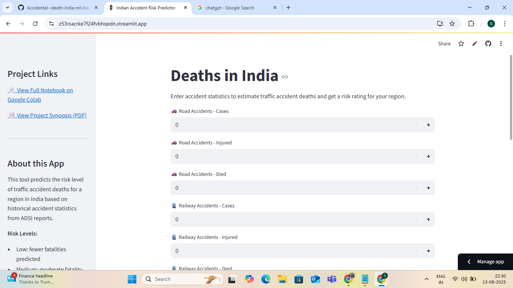

# 🚦 Indian Accident Risk Predictor

A **Machine Learning-based web application** that predicts the **risk level of accidental deaths in India** using historical accident statistics from the ADSI (Accidental Deaths & Suicides in India) report.  
The project is built with **Python**, trained in **Google Colab**, and deployed using **Streamlit**.

---

## 📊 Features
- Predicts risk level: **Low**, **Medium**, or **High**
- Estimates **predicted number of deaths** based on input values
- Interactive user interface for entering accident statistics
- Sidebar with quick access to:
  - Google Colab Notebook
  - Project Synopsis (PDF)
- Deployed live on Streamlit for instant use

---

## 📂 Dataset
**Source:** ADSI (Accidental Deaths & Suicides in India) Report  
*(If publicly shareable, include the official dataset link here)*

---

## 🖥️ Live App
[▶️ **Open Streamlit App**](https://sakshi-accident-risk-predictor.streamlit.app/)

---

## 📄 Project Files
- `app.py` → Main Streamlit application
- `requirements.txt` → Python dependencies list
- `final_pyml_project_of_accidental_deaths_in_india.ipynb` → Jupyter/Colab notebook for model training
- `rahul Project Synopsis .pdf` → Detailed project synopsis

---

## 🔗 Quick Links
- 📄 [Google Colab Notebook](https://colab.research.google.com/drive/1G-zgDZCNR_gz3PYv_ipddt-aqPleGq-B)
- 📑 [Project Synopsis (PDF)](https://raw.githubusercontent.com/sakshi3484/Accidental--death-india-ml-/main/sakshi%20,maansi%20Project%20Synopsis%20.pdf)
- 🚦 [Live Streamlit App](https://sakshi-accident-risk-predictor.streamlit.app/)

---

## 📷 Screenshot


---

## ⚙️ How to Run Locally
Follow these steps to run the app locally on your system:

```bash
# 1️⃣ Clone the repository
git clone https://github.com/sakshi3484/Accidental--death-india-ml-.git

# 2️⃣ Navigate into the project folder
cd Accidental--death-india-ml-

# 3️⃣ Install the dependencies
pip install -r requirements.txt

# 4️⃣ Run the Streamlit app
streamlit run app.py


🏆 Authors
Sakshi

Maansi


